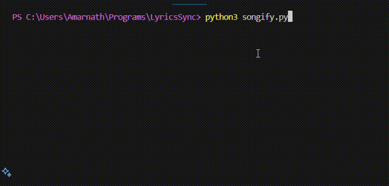

# LyricsSync

#### LyricsSync lets you enjoy a seamless karaoke-like experience 🎶 directly from your terminal by syncing song lyrics in real-time as the audio plays. Perfect for music enthusiasts! 🌟

<h2>Usage</h2>
<p><b>✨ Requires FFmpeg to be Installed.</b></p>

```bash
python3 songify.py <path-to-song>
```

<h2>Preview</h2>
<h4>🎥 Check it out in action:</h4>

<a href='assets/HtQ.mp4'>🔗 Watch Video with Sound 🔊</a>

<h2>License</h2>
This Script is provided under the terms of the [GPL-3.0 License](LICENSE).
